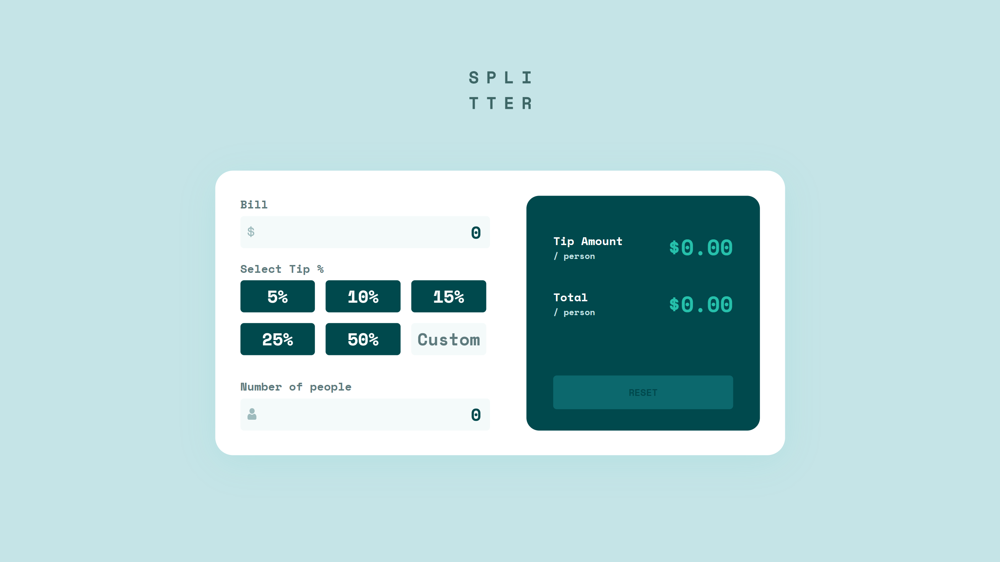
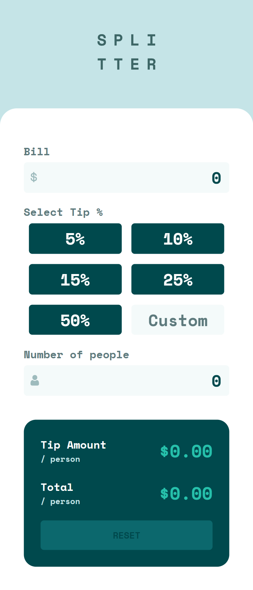

# Tip Calculator App

This is a simple and responsive web application built with a mobile-first approach from frontendmentor.io using HTML, CSS, and JavaScript that allows you to easily calculate the tip amount for your restaurant bill. The app requires you to enter the bill amount and the number of people sharing the bill. If the number of people is not entered, you will receive an error message.

The app offers 5 predefined options to choose from for the tip percentage that you wish to leave, and you also have a sixth option to enter a custom percentage in an input field. Once you select a tip percentage, the bill is divided by the number of people and multiplied by the selected option of percentage, and the tip amount for each person is calculated and displayed on the app. Additionally, the app also calculates the total amount for each person, taking into account the tip and the bill amount.

To start a new calculation, you can simply click the reset button, and the page will be reloaded. The app is easy to use and provides a quick way to calculate the tip amount and total amount for each person sharing the bill.

## How to use

1. Enter the bill amount.
2. Enter the number of people sharing the bill (this field is required).
3. Select one of the predefined tip percentage options or enter a custom percentage in the input field.
4. To start a new calculation, click the "Reset" button.

## Demo

A demo of the app is available at [Tip Calculator](https://kriskoagm.github.io/tip-calculator-app/)

## Screenshots

## Contributing

Contributions are welcome! If you would like to contribute to the project, please submit a pull request with your changes.

## License

This project is licensed under the MIT License - see the LICENSE.md file for details.
